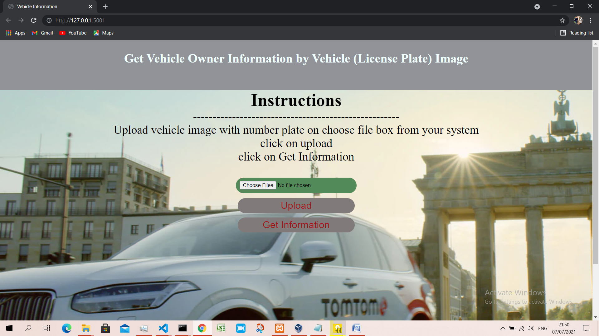
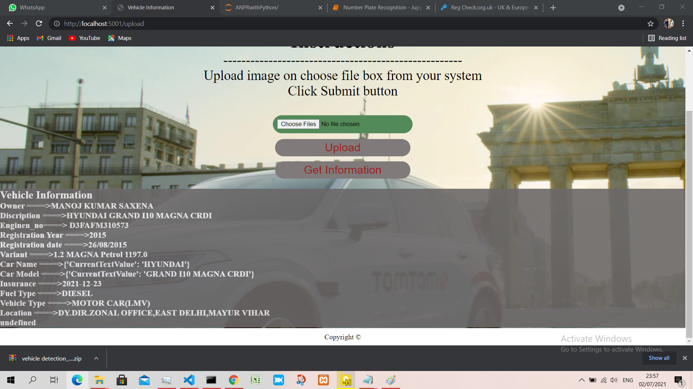

# Vehicle_information
Web app for Getting vehicle information on processing image of number plate of a vehicle(car).  
## problem statement   
1. Detecting number plate from given image 
2. Recognition of characters/numbers from number plate 
3. Fetching vehicle information using RTO API  
4. webapp using flask in backend 
   

